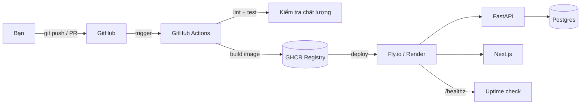

# DevOps Roadmap (Intern-level) — AntiRot (AI Socratic LMS)

> Kế hoạch triển khai quy trình DevOps cho dự án AntiRot, phục vụ mục tiêu đưa vào CV cho vị trí
> **DevOps Intern**. Ưu tiên **nền tảng vững + hiểu để giải thích được khi phỏng vấn**,
> không over-engineering.
>
> **Chốt hướng đi:** PaaS = **Fly.io / Render** (Docker) · CI/CD = **GitHub Actions** ·
> Ngân sách linh hoạt (ưu tiên học).

---

## Định hướng cho Intern

Nhà tuyển dụng **DevOps Intern** thường mong bạn:

- Biết **Git/GitHub** & làm việc theo branch/PR.
- Viết được **Dockerfile** + hiểu container là gì.
- Dựng được **CI cơ bản** (tự động test/build khi push).
- **Deploy** được app lên một dịch vụ cloud đơn giản.
- Hiểu **biến môi trường / secret**, health check, log cơ bản.
- Biết **giải thích** mình đã làm gì và tại sao.

> Nguyên tắc: **Làm ít nhưng hiểu sâu.** Mỗi thứ bạn đưa lên CV đều phải trả lời được câu
> "cái này là gì, tại sao cần, bạn làm thế nào".

Kế hoạch chia 2 phần:

- **Phần A — Core (bắt buộc):** đủ để tự tin ghi "DevOps" trên CV intern. ~2-3 tuần part-time.
- **Phần B — Stretch (điểm cộng):** làm thêm nếu còn thời gian, để nổi bật hơn.

---

## Bối cảnh dự án

**Hiện trạng (Before):** FastAPI backend + Next.js frontend + PostgreSQL + Google Gemini.
Deploy thủ công (Render + ngrok), **không** container, **không** CI/CD, **không** test.

**Mục tiêu (After):** có vòng đời tự động cơ bản:
`Code → Push → CI (test + build Docker) → Deploy lên cloud → Health check`.

---

# PHẦN A — CORE (bắt buộc)

---

### Pha 0 — Dọn repo & nền tảng Git  ⏱️ ~1 ngày

**Mục tiêu:** repo sạch, gọn, dễ đọc — ấn tượng đầu tiên khi nhà tuyển dụng mở GitHub.

**Công việc:**

- [x] Xóa file rác: `backend/ngrok.exe` (32MB) và file `qlalchemy import Column...` (là merge-diff commit nhầm).
- [x] Kiểm tra & hoàn thiện `.gitignore` (đảm bảo `.env`, `__pycache__`, `node_modules` bị ignore).
- [ ] Thêm `backend/.env.example` + `frontend/.env.example` liệt kê các biến cần thiết (không chứa giá trị thật).
- [ ] Viết lại `README.md` gốc: dự án là gì, tech stack, cách chạy local từng bước.
- [ ] Làm quen quy trình **branch + Pull Request** (không commit thẳng vào `main`).

**Công cụ:** Git, GitHub.

**CV talking point:** *"Chuẩn hóa repository, viết tài liệu README và làm việc theo quy trình branch/PR."*

> Ghi chú: xóa file khỏi lịch sử git (git-filter-repo) là nâng cao — với intern chỉ cần `git rm` + commit là ổn.

---

### Pha 1 — Test cơ bản & sửa cấu hình  ⏱️ ~3-4 ngày

**Mục tiêu:** có vài test tự động + sửa các lỗi cấu hình rõ ràng nhất (để CI có cái để chạy).

**Công việc:**

- [x] **Backend:** viết vài test với `pytest` cho endpoint đơn giản (vd: `/healthz`, register/login) dùng FastAPI `TestClient`. Mục tiêu: 5-10 test chạy được.
- [x] Thêm health endpoint `/healthz` (trả về `{"status": "ok"}`).
- [x] Sửa nhanh vài lỗi cấu hình dễ hiểu:
  - Đưa `SECRET_KEY`, `DATABASE_URL`, `GEMINI_API_KEY` vào biến môi trường (bỏ giá trị mặc định hardcode).
  - CORS: đọc danh sách origin từ env thay vì `["*"]`.
- [ ] (Tùy chọn) Thêm 1 test frontend đơn giản với `Vitest`.

**Công cụ:** `pytest`, FastAPI `TestClient`, `python-dotenv`.

**CV talking point:** *"Viết unit test với pytest và chuẩn hóa quản lý cấu hình qua biến môi trường."*

> Ghi chú: Auth/Alembic/Testcontainers là nâng cao — để ở Phần B, không bắt buộc cho intern.

---

### Pha 2 — Docker  ⏱️ ~2-3 ngày

**Mục tiêu:** đóng gói app vào container + chạy được cả hệ thống bằng 1 lệnh. Đây là **kỹ năng lõi** intern DevOps.

**Công việc:**

- [x] Viết `backend/Dockerfile` (dùng `python:3.12-slim`, cài requirements, chạy `uvicorn`).
- [x] Viết `frontend/Dockerfile` cho Next.js.
- [x] Thêm `.dockerignore` cho cả hai (bỏ `node_modules`, `__pycache__`, `.env`...).
- [x] Viết `docker-compose.yml`: chạy `api` + `web` + `postgres` cùng lúc, test được bằng `docker compose up`.
- [ ] Hiểu & giải thích được: image vs container, layer, port mapping, volume.

**Công cụ:** Docker, Docker Compose.

**CV talking point:** *"Container hóa ứng dụng full-stack bằng Docker và dựng môi trường phát triển local với Docker Compose."*

> Nâng cao (Phần B): multi-stage build, non-root user, tối ưu image size.

---

### Pha 3 — CI với GitHub Actions  ⏱️ ~2-3 ngày

**Mục tiêu:** mỗi lần push/PR, GitHub tự động chạy test và build Docker. Đây là phần "CI/CD" cốt lõi.

**Công việc:**

- [ ] Tạo `.github/workflows/ci.yml` với các bước:
  - checkout code
  - cài Python + dependencies (có cache)
  - chạy `pytest`
  - build Docker image (kiểm tra Dockerfile build được)
- [ ] Thêm **badge** trạng thái CI vào README.
- [ ] Bật **branch protection** đơn giản: `main` yêu cầu CI xanh trước khi merge.
- [ ] Hiểu & giải thích được: workflow, job, step, trigger (`on: push` / `pull_request`).

**Công cụ:** GitHub Actions.

**CV talking point:** *"Xây dựng CI pipeline trên GitHub Actions tự động chạy test và build Docker image cho mỗi Pull Request."*

---

### Pha 4 — Deploy lên Cloud (CD cơ bản)  ⏱️ ~2-3 ngày

**Mục tiêu:** app chạy thật trên internet, có link để đưa vào CV.

**Công việc:**

- [ ] Deploy backend + frontend lên **Fly.io** (hoặc Render) bằng Docker image.
- [ ] Dùng **managed Postgres** của Fly/Render (không tự cài DB).
- [ ] Cấu hình **secrets** trên nền tảng (SECRET_KEY, DATABASE_URL, GEMINI_API_KEY) — không để lộ trong code.
- [ ] (Tùy chọn nâng nhẹ) Thêm `deploy.yml`: tự động deploy khi merge vào `main` (`flyctl deploy`).
- [ ] Kiểm tra `/healthz` chạy được sau deploy.

**Công cụ:** Fly.io CLI (`flyctl`) hoặc Render, GitHub Actions (cho auto-deploy).

**CV talking point:** *"Triển khai ứng dụng lên cloud (Fly.io) bằng container, quản lý secret và tự động deploy qua CI/CD."*

---

### Pha 5 — Tài liệu & đóng gói cho CV  ⏱️ ~1 ngày

**Mục tiêu:** kể lại câu chuyện gọn gàng để nhà tuyển dụng thấy ngay.

**Công việc:**

- [ ] `README` hoàn chỉnh: sơ đồ kiến trúc (Mermaid), badges CI, link demo, hướng dẫn chạy.
- [ ] Bảng **Before / After** (trước: deploy tay; sau: Docker + CI/CD + cloud).
- [ ] Viết 3-4 gạch đầu dòng mô tả dự án cho CV.
- [ ] Chuẩn bị trả lời phỏng vấn: "Docker để làm gì?", "CI pipeline của bạn chạy gì?", "Deploy thế nào?".

**CV talking point:** *"Tài liệu hóa kiến trúc và quy trình CI/CD, trình bày rõ ràng cho người đọc."*

---

# PHẦN B — STRETCH (điểm cộng, làm nếu còn thời gian)

Chỉ làm khi Phần A đã xong và bạn hiểu chắc. Mỗi mục là một "điểm nổi bật" so với intern khác.

- **Security scan trong CI:** thêm `Trivy` (quét image) hoặc `gitleaks` (quét lộ secret) vào workflow.
- **Multi-stage Docker + non-root:** tối ưu image nhỏ hơn, an toàn hơn.
- **Alembic migrations:** quản lý schema DB bằng version thay vì `create_all()`.
- **Sửa auth đúng chuẩn:** thêm middleware verify JWT (hiện tại API cấp token nhưng không kiểm tra → lỗ hổng).
- **Monitoring cơ bản:** UptimeRobot ping `/healthz` + (nếu thích) Grafana Cloud xem metrics.
- **Terraform nhẹ:** khai báo hạ tầng Fly.io bằng code (giới thiệu khái niệm IaC).
- **Staging + Production:** 2 môi trường tách biệt.

---

## Bảng ánh xạ Kỹ năng ↔ CV (Intern)

| Pha | Kỹ năng chứng minh được                            |
| --- | -------------------------------------------------- |
| 0   | Git, GitHub, branch/PR, viết tài liệu              |
| 1   | Testing cơ bản (pytest), quản lý config/env        |
| 2   | **Docker, Docker Compose** (kỹ năng lõi)           |
| 3   | **CI, GitHub Actions** (kỹ năng lõi)               |
| 4   | **Deploy cloud, secrets, CD cơ bản** (kỹ năng lõi) |
| 5   | Tài liệu hóa, giao tiếp kỹ thuật                   |
| B   | DevSecOps, IaC, migration, monitoring (điểm cộng)  |

## Thứ tự thực thi đề xuất

1. **Pha 0 → 1** (dọn repo + có test).
2. **Pha 2 → 3 → 4** (khối lõi: Docker → CI → Deploy — quan trọng nhất cho CV).
3. **Pha 5** (đóng gói câu chuyện).
4. Nhặt dần **Phần B** nếu còn thời gian.

> **Tổng thời gian Phần A:** ~2-3 tuần part-time.

---

## Lời khuyên phỏng vấn Intern

- Thà làm 4 thứ mà hiểu rõ, còn hơn 10 thứ chỉ copy config.
- Chuẩn bị giải thích được **luồng đi của 1 lần deploy**: từ lúc bạn `git push` đến khi app chạy trên cloud.
- Biết vẽ lại sơ đồ pipeline trên giấy là một điểm cộng lớn.

